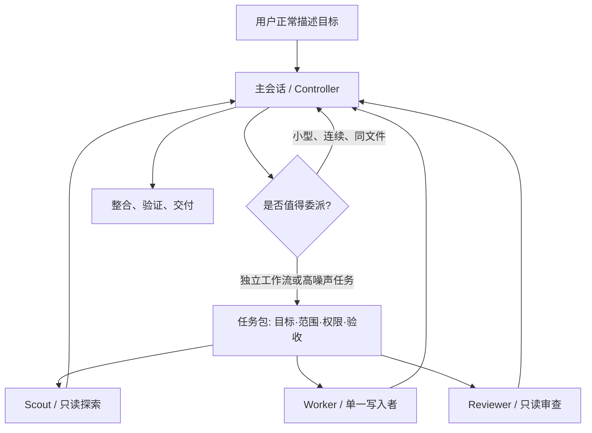

# Agent Strata

一套面向 **Codex** 与 **Claude Code** 的分层 Agent 编排方案：主会话保留目标、约束和最终责任，把探索、实现、验证与审查交给不同能力层级的原生子 Agent。

> 这不是“尽可能多开 Agent”的方案。它只在任务能安全拆分时并行，默认最多 3 个子 Agent、同时只有 1 个写入者，并让写代码的 Agent 使用 `xhigh` 推理强度。

## 为什么需要分层

长任务真正稀缺的通常不是上下文窗口本身，而是主会话里的有效注意力。搜索结果、日志、试错过程和重复代码会造成 context pollution；多个写入者同时改动又会引入冲突和责任模糊。

Agent Strata 采用四条核心原则：

1. **一个主控**：主会话拥有完整目标、权限边界、任务拆分、冲突裁决与最终交付。
2. **按工作形态选模型**：快速模型负责查找，平衡模型负责常规实现，最强模型负责复杂实现与高风险审查。
3. **默认一个写入者**：并行优先用于只读探索、资料核验和审查；写入任务只有路径完全不重叠时才例外。
4. **结果压缩回传**：子 Agent 返回结论、证据、改动、验证和风险，不把整段日志倒回主会话。



## 推荐分层

| 工作类型 | Codex | Claude Code | 推理强度 | 默认权限 |
|---|---|---|---|---|
| 快速定位、依赖梳理 | Luna Scout | Haiku Scout | `medium` / 继承 | 只读 |
| 明确的机械操作 | Luna Executor | 不单设；由主控直接处理 | `medium` | 有界写入 |
| 常规代码实现、普通修复 | Terra Worker | Sonnet Worker | **`xhigh`** | 工作区写入 |
| 跨模块、模糊、高风险实现 | Sol Worker | Opus Worker | **`xhigh`** | 工作区写入 |
| 高风险最终审查 | Sol Reviewer | Opus Reviewer | **`xhigh`** | 只读 |
| 超长、最高难度任务 | 主会话 Sol | Fable Controller / Worker / Reviewer | **`xhigh`** | 显式启用 |

推荐基线不是绝对真理。模型可用性、套餐、组织策略和 CLI 版本不同，安装时应先核验当前环境，再合并配置。

Claude 的 `sonnet` / `opus` alias 在部分第三方 provider 上可能解析到不支持 `xhigh` 的旧模型，客户端会降到可用的较低档。安装完成的硬性验收是检查**实际解析后的模型和 effort**；不满足时应 pin 组织批准且支持 `xhigh` 的完整模型 ID，或明确报告该约束未满足。

## 快速安装

### 1. 安装 skill

同时安装到 Codex 和 Claude Code，且对本机所有项目生效：

```bash
npx -y skills@1.5.23 add SanStone3/agent-strata \
  --global \
  --agent codex claude-code \
  --skill layered-orchestration \
  --yes
```

只安装到一个客户端：

```bash
npx -y skills@1.5.23 add SanStone3/agent-strata -g -a codex -s layered-orchestration -y
npx -y skills@1.5.23 add SanStone3/agent-strata -g -a claude-code -s layered-orchestration -y
```

项目级安装时去掉 `--global`，并在项目根目录执行。

### 2. 让 AI 完成配置合并

安装 skill 后，在 Codex 或 Claude Code 中分别发送：

```text
使用 layered-orchestration skill，为当前客户端安装 Agent Strata 的全局配置。
先检查现有配置和当前版本；备份后只做增量合并，不覆盖无关设置。
采用推荐模型分层，主会话与代码 Worker 使用 xhigh；安装完成后运行校验并报告差异。
不要配置 Codex 与 Claude 互相调用。
```

如果只希望当前项目使用，把“全局配置”改为“项目配置”。

为什么分两步？`npx skills` 负责安装工作流说明；`config.toml`、`settings.json`、Agent 定义和项目规则可能已经包含用户自己的模型、权限、MCP 与 hooks，必须检查后合并，不能由通用安装脚本覆盖。

完整步骤见 [安装与作用域](docs/installation.md)。

## 配好以后怎么用

正常写 prompt 即可。主会话会根据 skill 与全局/项目规则判断是否委派：

```text
修复订单取消后库存偶发未释放的问题，完成代码修改和允许范围内的验证。
```

对于小改动，主会话会直接完成；对于能独立拆分的复杂任务，它会自主选择 Scout、Worker 和 Reviewer。需要强制并行或指定审查面时，可以明确写：

```text
并行委派只读 Agent，分别检查并发安全、数据迁移和测试缺口；等待全部结果后统一给出结论。
```

详见 [编排模式与示例](docs/orchestration.md)。

## 全局配置还是项目配置

| 目标 | Codex | Claude Code | 适用场景 |
|---|---|---|---|
| 本机所有项目 | `~/.codex/config.toml`、`~/.codex/agents/`、`~/.agents/skills/` | `~/.claude/settings.json`、`~/.claude/agents/`、`~/.claude/skills/` | 个人默认工作方式 |
| 单个项目/团队共享 | `.codex/config.toml`、`.codex/agents/`、`.agents/skills/`、`AGENTS.md` | `.claude/settings.json`、`.claude/agents/`、`.claude/skills/`、`CLAUDE.md` | 仓库特有约束、团队共识 |

项目规则始终高于这套通用编排建议。不要把组织权限、构建方式或发布规则硬编码进全局 skill。

## Codex 与 Claude 分开配置

本仓库只利用各自客户端的原生子 Agent 能力：

- Codex 主会话只编排 Codex 原生 Agent。
- Claude 主会话只编排 Claude 原生 Agent。
- 不提供 Codex 调 Claude、Claude 调 Codex、共享凭据或跨厂商后台进程。
- 两套配置可以同时安装在一台电脑上，但运行时互不依赖。

## 关于 Fable

Fable 是 Claude Code 中显式选择的最高能力层，不是默认模型。模板将默认主会话设为 `opus[1m]` + `xhigh`，并提供 `fable-controller`、`fable-worker` 与 `fable-reviewer`：

```bash
claude --agent fable-controller
```

只有在账户可用额度或已同意 usage credits 时才使用 Fable。认证、计费、限流与传输错误不会触发 Claude Code 的模型 fallback；不要把 fallback 当作额度耗尽时的自动降级机制，也不要循环重试 Fable。

## 仓库内容

```text
skills/layered-orchestration/
├── SKILL.md                 # AI 的入口与路由规则
├── references/              # 安装、双端配置、任务契约和校验说明
├── assets/templates/        # 可合并的 Codex / Claude 模板
└── scripts/validate.py      # 只读结构校验
docs/
├── installation.md          # 人工与 AI 安装、全局/项目作用域
└── orchestration.md         # 详细编排形式、升级条件和示例
tests/
└── test_validate.py         # 对错误模型、effort、YAML 与泄密检测做变异测试
```

## 校验

```bash
python3 skills/layered-orchestration/scripts/validate.py --repo .
python3 /path/to/skill-creator/scripts/quick_validate.py \
  skills/layered-orchestration
python3 -m unittest discover -s tests -v
npx -y skills@1.5.23 add . --list
```

加 `--codex-home ~/.codex` 或 `--claude-home ~/.claude` 可对本机已安装的活配置做同样的只读校验（检查实际生效的模型、effort、工具列表与禁令，而不只是仓库模板）。

`validate.py` 只读取文件，不修改用户配置。

上面的 `skills` 是 [Vercel Labs 的开源 CLI](https://github.com/vercel-labs/skills)，不是 Codex 或 Claude Code 的内建命令。本仓库锁定并验证 `1.5.23`，升级前应重新运行安装与发现测试。

## 版本与依据

本方案于 **2026-08-20** 对照以下官方文档核验：

- [OpenAI：Codex Subagents](https://developers.openai.com/codex/subagents)
- [OpenAI：Codex Skills](https://developers.openai.com/codex/skills)
- [OpenAI：Codex Config Basics](https://developers.openai.com/codex/config-basic)
- [OpenAI：AGENTS.md](https://developers.openai.com/codex/guides/agents-md)
- [OpenAI：GPT-5.6 Model Guidance](https://developers.openai.com/api/docs/guides/latest-model)
- [Anthropic：Claude Code Skills](https://code.claude.com/docs/en/skills)
- [Anthropic：Claude Code Subagents](https://code.claude.com/docs/en/sub-agents)
- [Anthropic：Model Configuration](https://code.claude.com/docs/en/model-config)
- [Anthropic：Claude Code Settings](https://code.claude.com/docs/en/settings)

模型别名会随厂商更新。生产环境若要求可复现，应在验证账号可用性后使用完整模型 ID；个人环境可使用官方别名跟随推荐版本。

## License

[MIT](LICENSE)
