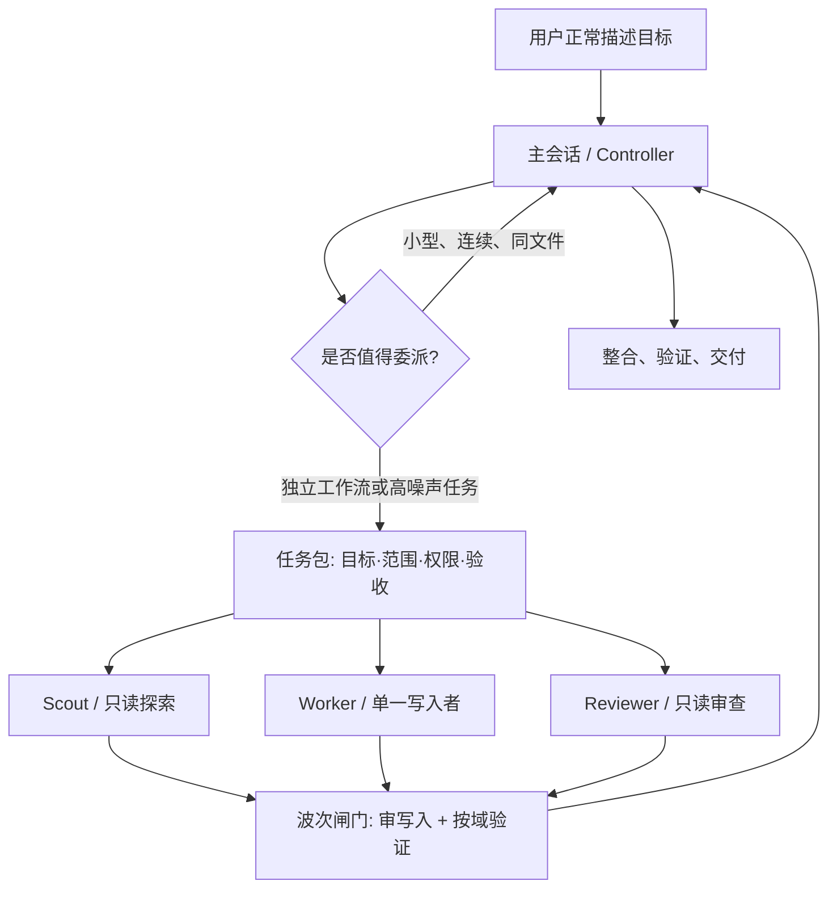

# Agent Strata

一套面向 **Codex** 与 **Claude Code** 的分层 Agent 编排方案，以名为 **`strata`** 的 skill 分发：主会话保留目标、约束和最终责任，把探索、实现、验证与审查交给不同能力层级的原生子 Agent。

> 这不是“尽可能多开 Agent”的方案。它只在任务能安全拆分时并行：默认并发预算为 3 个活跃子 Agent、1 个写入者，写代码的 Agent 使用 `xhigh` 推理强度。**这个 3 限制的是同时在跑的数量，不是任务总量**——更多工作以波次推进，需要多个写入者时按写域划分并逐条过清单。

## 为什么需要分层

长任务真正稀缺的通常不是上下文窗口本身，而是主会话里的有效注意力。搜索结果、日志、试错过程和重复代码会造成 context pollution；多个写入者同时改动又会引入冲突和责任模糊。

Agent Strata 采用六条核心原则：

1. **一个主控**：主会话拥有完整目标、权限边界、任务拆分、冲突裁决与最终交付。
2. **按工作形态选模型**：快速模型负责查找，平衡模型负责常规实现，最强模型负责复杂实现与高风险审查。
3. **默认一个写入者**：并行优先用于只读探索、资料核验和审查；多个写入者只在写域（可写路径清单）互不相交、共享契约已冻结、每个域都有独立验证时才成立。
4. **结果压缩回传**：子 Agent 返回结论、证据、改动、验证和风险，不把整段日志倒回主会话。
5. **按波次推进**：任务包总数不限，但同时活跃的数量受预算约束；波次之间有闸门，主控审完写入、跑完按域验证，再基于真实状态重写下一波。
6. **过程可观测**：委派前列出 Agent 分工与波次计划，每个子 Agent 启动、阻塞、完成时在主线程简短报告，委派过程不是黑盒。



## 推荐分层

| 工作类型 | Codex | Claude Code | 推理强度 | 默认权限 |
|---|---|---|---|---|
| 快速定位、依赖梳理 | `scout`（动态效率层） | Haiku Scout | `medium` / 继承 | 只读 |
| 明确的机械操作 | `executor`（动态效率层） | 不单设；由主控直接处理 | `medium` | 有界写入 |
| 常规代码实现、普通修复 | `worker`（动态平衡层） | Sonnet Worker | **`xhigh`** | 工作区写入 |
| 跨模块、模糊、高风险实现 | `deep_worker`（动态深度层） | Opus Worker | **`xhigh`** | 工作区写入 |
| 高风险最终审查 | `reviewer`（动态深度层） | Opus Reviewer | **`xhigh`** | 只读 |
| 主控规划与整合 | 最强可用深度层 `controller` | Fable Controller / Worker / Reviewer | **`xhigh`** | 显式启用 |

推荐基线不是绝对真理。模型可用性、套餐、组织策略和 CLI 版本不同，安装时应先核验当前环境，再合并配置。

Claude 的 `sonnet` / `opus` alias 在部分第三方 provider 上可能解析到不支持 `xhigh` 的旧模型，客户端会降到可用的较低档。安装完成的硬性验收是检查**实际解析后的模型和 effort**；不满足时应 pin 组织批准且支持 `xhigh` 的完整模型 ID，或明确报告该约束未满足。

## Codex 模型自适应

Codex 角色名与具体型号已分离。首次委派时，从当前调用工具的模型/effort 列表解析绑定；必要时通过短生命周期 app-server 的 `model/list` 补充目录。支持同系列新版本、明确的升级关系、用户固定型号、工具白名单交集和同层备选。未知能力的新系列保持未分类，不按版本号猜能力。

```bash
# 只读发现并解析，不启动推理、不修改配置
python3 skills/strata/scripts/resolve_models.py --discover

# 生成待合并的配置；输出目录必须尚不存在
python3 skills/strata/scripts/resolve_models.py --discover --output-dir /path/to/new-staging-dir
```

当前已核验的策略将 GPT-6 Luna、GPT-6.1 Sol、GPT-6 Astra 分别作为效率、平衡、深度层候选；最终 ID 和 `xhigh` 支持取决于当前目录与工具限制。主控默认同样解析为最强可用深度层 + `xhigh`。支持 `--pin controller=MODEL` 固定选择，或 `--preserve-primary` 保留原主模型和 effort；上下文设置始终保留。仅列出模型不能证明账号访问权限。

原生工具支持覆盖模型时，每次调用明确传入绑定；仅支持命名 Agent 的客户端需要合并生成的定义并在会话边界刷新。模板本身不含型号，不能直接当作已绑定配置安装。旧角色名有迁移映射，校验器不再强制 GPT-5.6。详见 [模型路由、升级与回退](skills/strata/references/model-routing.md)。

## 并发预算：3 不是天花板

“最多 3 个”是**默认并发预算**，和客户端的机制上限、以及任务的总工作量是三件不同的事：

| 数量 | 含义 | 默认 |
|---|---|---|
| 客户端上限 | 客户端机制强制的天花板 | Codex：3 个子线程（含主线程共 4，`agents.max_concurrent_threads_per_session`）；Claude Code：20 个并发子 Agent（`CLAUDE_CODE_MAX_CONCURRENT_SUBAGENTS`，最高 effort 会话不强制） |
| 并发预算 | 主控选择同时保持活跃的数量 | 3 个活跃、1 个写入者 |
| 写域 | 校验过互不相交的可写路径集合 | 1 个 |
| 任务包总数 | 整个任务委派出去的包总数 | 不限 |

```text
并发预算 = min(客户端上限, 写入者 + 读取者)
```

12 个任务包是常态：跑 4 个波次，而不是开 12 条线程。真正卡住并行度的从来不是那个数字，而是**写域能不能切干净**和**主控能不能审完**。确实需要更多同时动工的 Agent 时，必须整条清单成立：全只读扇出，或每个写入者持有显式路径清单校验过的独立写域；共享契约（接口、schema、lockfile、生成物）已由主控先落地并冻结；每个域有独立验证命令；每个包在结果预算内返回；主控有余力在下一波前审完每一处写入；多出来的开销已获授权。任何一条不成立，正确答案是串行，而不是调高数字。

调高客户端上限后要验证**实际并行度**而不是配置值：部分 Codex 版本由 multi-agent 第二代特性接管并发，旧键会被静默忽略。Claude Code 侧模板则把 `CLAUDE_CODE_MAX_SUBAGENT_SPAWN_DEPTH` 设为 `1`，让“子 Agent 不再派生孙 Agent”从纸面约束变成客户端机制约束。

详见 [`skills/strata/references/scaling.md`](skills/strata/references/scaling.md)（AI 运行时读的那份）与 [编排模式与示例](docs/orchestration.md#3-并发预算写域与波次)。

## 快速安装

### 1. 安装 skill

同时安装到 Codex 和 Claude Code，且对本机所有项目生效：

```bash
npx -y skills@1.5.23 add SanStone3/agent-strata \
  --global \
  --agent codex claude-code \
  --skill strata \
  --yes
```

只安装到一个客户端：

```bash
npx -y skills@1.5.23 add SanStone3/agent-strata -g -a codex -s strata -y
npx -y skills@1.5.23 add SanStone3/agent-strata -g -a claude-code -s strata -y
```

项目级安装时去掉 `--global`，并在项目根目录执行。

### 2. 让 AI 完成配置合并

安装 skill 后，在 Codex 或 Claude Code 中分别发送：

```text
使用 strata skill，为当前客户端安装 Agent Strata 的全局配置。
先检查现有配置和当前版本；备份后只做增量合并，不覆盖无关设置。
Codex 先解析当前模型目录并生成角色绑定，主控采用最强可用层 + xhigh，尊重用户明确固定的型号，保留上下文设置；代码 Worker 使用 xhigh。
安装完成后运行校验并报告实际模型、effort 与差异。
不要配置 Codex 与 Claude 互相调用。
```

如果只希望当前项目使用，把“全局配置”改为“项目配置”。

为什么分两步？`npx skills` 负责安装工作流说明；`config.toml`、`settings.json`、Agent 定义和项目规则可能已经包含用户自己的模型、权限、MCP 与 hooks，必须检查后合并，不能由通用安装脚本覆盖。

完整步骤见 [安装与作用域](docs/installation.md)。

## 配好以后怎么用

正常写 prompt 即可。主会话会根据 skill 与全局/项目规则判断是否委派：

```text
修复订单取消后库存偶发未释放的问题，完成代码修改和允许范围内的验证。
```

对于小改动，主会话会直接完成；对于能独立拆分的复杂任务，它会自主选择 Scout、Worker 和 Reviewer。需要强制并行或指定审查面时，可以明确写：

```text
并行委派只读 Agent，分别检查并发安全、数据迁移和测试缺口；等待全部结果后统一给出结论。
```

详见 [编排模式与示例](docs/orchestration.md)。

## 全局配置还是项目配置

| 目标 | Codex | Claude Code | 适用场景 |
|---|---|---|---|
| 本机所有项目 | `~/.codex/config.toml`、`~/.codex/agents/`、`~/.agents/skills/` | `~/.claude/settings.json`、`~/.claude/agents/`、`~/.claude/skills/` | 个人默认工作方式 |
| 单个项目/团队共享 | `.codex/config.toml`、`.codex/agents/`、`.agents/skills/`、`AGENTS.md` | `.claude/settings.json`、`.claude/agents/`、`.claude/skills/`、`CLAUDE.md` | 仓库特有约束、团队共识 |

项目规则始终高于这套通用编排建议。不要把组织权限、构建方式或发布规则硬编码进全局 skill。

## Codex 与 Claude 分开配置

本仓库只利用各自客户端的原生子 Agent 能力：

- Codex 主会话只编排 Codex 原生 Agent。
- Claude 主会话只编排 Claude 原生 Agent。
- 不提供 Codex 调 Claude、Claude 调 Codex、共享凭据或跨厂商后台进程。
- 两套配置可以同时安装在一台电脑上，但运行时互不依赖。

## 关于 Fable

Fable 是 Claude Code 中显式选择的最高能力层，不是默认模型。模板将默认主会话设为 `opus[1m]` + `xhigh`，并提供 `fable-controller`、`fable-worker` 与 `fable-reviewer`：

```bash
claude --agent fable-controller
```

只有在账户可用额度或已同意 usage credits 时才使用 Fable。认证、计费、限流与传输错误不会触发 Claude Code 的模型 fallback；不要把 fallback 当作额度耗尽时的自动降级机制，也不要循环重试 Fable。

## 仓库内容

```text
skills/strata/
├── SKILL.md                 # AI 的入口与路由规则
├── references/              # 安装、双端配置、任务契约、并发扩容和校验说明
├── assets/templates/        # 可合并的 Codex / Claude 模板
└── scripts/                 # 动态模型解析、配置生成与只读校验
docs/
├── installation.md          # 人工与 AI 安装、全局/项目作用域
└── orchestration.md         # 详细编排形式、升级条件和示例
tests/
├── test_validate.py         # 配置、权限与泄密检测的变异测试
└── test_resolve_models.py   # 动态路由、失败恢复、协议与迁移测试
```

## 校验

```bash
python3 skills/strata/scripts/validate.py --repo .
python3 /path/to/skill-creator/scripts/quick_validate.py \
  skills/strata
python3 -m unittest discover -s tests -v
npx -y skills@1.5.23 add . --list
```

加 `--codex-home ~/.codex` 或 `--claude-home ~/.claude` 可对本机已安装的活配置做同样的只读校验（检查配置中的模型、effort、工具列表、并发上限、`CLAUDE_CODE_MAX_SUBAGENT_SPAWN_DEPTH` 与核心禁令，而不只是仓库模板）。模板固定并发预算为 3；生成配置包含最强可用主控 + xhigh，显式保留模式除外；上下文设置不变。Codex 加 `--bindings /path/to/model-bindings.json` 可校验解析结果与安装值一致；不加时会明确提示模型兼容性未验证。结构校验不能代替客户端实际生效值和推理访问验证。

`validate.py` 只读取文件，不修改用户配置。

上面的 `skills` 是 [Vercel Labs 的开源 CLI](https://github.com/vercel-labs/skills)，不是 Codex 或 Claude Code 的内建命令。本仓库锁定并验证 `1.5.23`，升级前应重新运行安装与发现测试。

## 版本与依据

模型自适应于 **2026-10-08** 对照当前模型选择与 app-server 文档核验。原编排方案于 **2026-08-20** 对照官方文档核验，并于 **2026-09-20** 重新核验并发与嵌套相关事实（Codex 默认 4 线程含主线程、Claude Code 默认 20 并发与 3 层嵌套、两端相关配置键）：

- [OpenAI：Codex Subagents](https://developers.openai.com/codex/subagents)
- [OpenAI：Codex Skills](https://developers.openai.com/codex/skills)
- [OpenAI：Codex Config Basics](https://developers.openai.com/codex/config-basic)
- [OpenAI：Codex Sample Configuration](https://developers.openai.com/codex/config-sample)
- [OpenAI：AGENTS.md](https://developers.openai.com/codex/guides/agents-md)
- [OpenAI：Current Model Guidance](https://developers.openai.com/api/docs/guides/latest-model)
- [Anthropic：Claude Code Skills](https://code.claude.com/docs/en/skills)
- [Anthropic：Claude Code Subagents](https://code.claude.com/docs/en/sub-agents)
- [Anthropic：Claude Code Environment Variables](https://code.claude.com/docs/en/env-vars)
- [Anthropic：Model Configuration](https://code.claude.com/docs/en/model-config)
- [Anthropic：Claude Code Settings](https://code.claude.com/docs/en/settings)

模型别名会随厂商更新。生产环境若要求可复现，应在验证账号可用性后使用完整模型 ID；个人环境可使用官方别名跟随推荐版本。

## License

[MIT](LICENSE)
