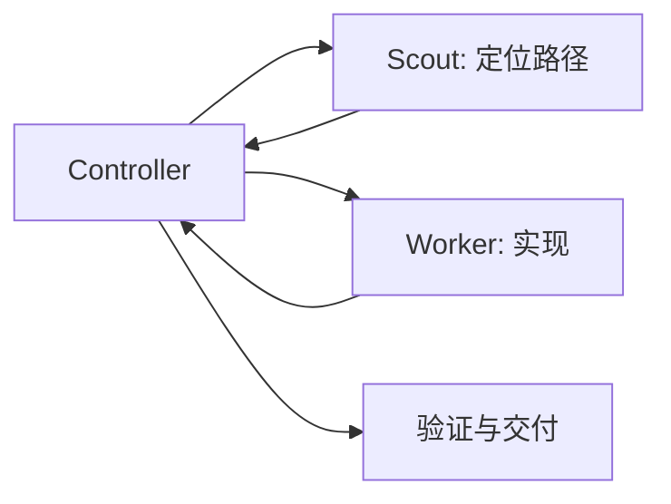
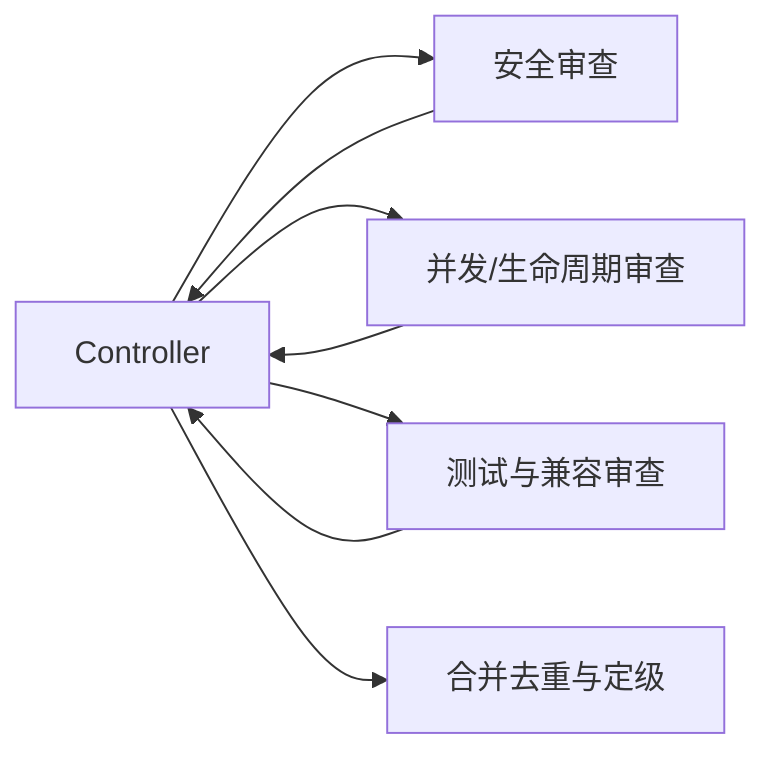
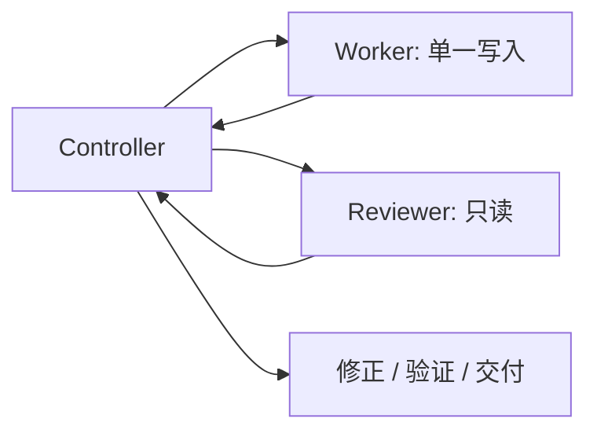

# 编排模式与示例

## 主控的职责

主会话不是“派活机器人”，而是唯一对最终结果负责的 Controller：

- 保留完整目标、用户约束、项目规则和授权边界。
- 判断哪些工作应直接做、哪些值得委派。
- 为每个子 Agent 划定目标、路径、权限、验收与停止条件。
- 避免并发写入冲突，接收并压缩子 Agent 结果。
- 检查最终 diff，运行项目允许的验证，向用户交付。

不要把整个模糊任务原样转发给子 Agent，也不要让子 Agent自行扩张范围。

## 决策流程

### 1. 先判断是否需要子 Agent

直接由主会话完成：

- 一两个文件内的小改动；
- 下一步依赖上一步结果，无法并行；
- 委派成本高于任务本身；
- 多个任务会修改同一文件或同一状态；
- 用户只要求解释、诊断或审阅，没有授权改动。

适合委派：

- 两个以上互相独立的代码/资料工作流；
- 大量搜索、日志、测试输出会污染主上下文；
- 需要独立审查安全、并发、迁移或兼容风险；
- 能用明确目录、模块或输出边界隔离；
- 长任务需要 Controller 持续保留全局状态。

### 2. 按任务形态选层级

```text
只读查找、枚举、定位              -> Luna / Haiku Scout
完全明确的机械变换或命令           -> Luna Executor（Codex）
边界清楚的普通实现与测试修复        -> Terra / Sonnet Worker，xhigh
跨模块、接口、并发、安全、生命周期   -> Sol / Opus Worker，xhigh
高风险最终审查                     -> Sol / Opus Reviewer，xhigh
多阶段、超长、代价极高的 Claude 任务 -> Fable，显式启用且 xhigh
```

关键点：**代码 Worker 不因“只是子 Agent”而降低推理强度。** 较低层级体现的是模型成本/速度，不是让代码生成使用低 effort。常规代码层仍为 `xhigh`；只有只读 Scout 与纯机械 Executor 使用较低 effort。

### 3. 控制并发与写入

默认：

- 最多 3 个活跃子 Agent；
- 最多 1 个写入者；
- Scout 与 Reviewer 只读；
- 子 Agent 不再生成孙 Agent；
- 主控等待相关结果后再综合。

只有同时满足以下条件才考虑多个写入者：

1. 路径和状态完全不重叠；
2. 接口契约已经固定；
3. 项目规则允许并行写入；
4. 主控能独立验证并整合每个结果；
5. 冲突或失败可安全回滚。

## 标准任务包

每次委派至少包含：

```text
目标：完成什么可观察结果
上下文：已知事实、入口与为什么现在做
范围：允许读取/修改的路径或模块
禁止：不能做的动作、不能碰的路径
权限：只读或写入；是否可运行命令
验收：完成的证据和允许的验证
停止条件：冲突、缺权限、假设不成立时如何处理
返回格式：状态、结论、文件/符号、验证、风险、下一步
```

示例：

```text
目标：修复支付回调重复处理导致的双重记账。
上下文：入口在 callbacks/payment；幂等键已由网关传入。
范围：src/payments/callbacks/** 和对应单元测试。
禁止：不改数据库 schema，不提交，不部署，不修改公共 API。
权限：单一写入者；可运行 payment package 的单元测试。
验收：重复回调只记账一次；现有正常回调测试通过。
停止条件：若需要 schema 或跨服务契约变更，停止并回报主控。
返回：状态、改动文件/符号、关键决策、测试结果、残余风险。
```

## 标准结果契约

Scout / Worker 返回：

```text
status: completed | partial | blocked
summary: 1–3 句
findings_or_changes: 最多 5 项，带文件/符号证据
validation: 执行了什么、结果如何
uncertainties: 尚未证实的事实
risks: 残余风险
recommended_next_step: 主控下一步
```

Reviewer 返回 findings first，按严重程度排序。每项必须包含：位置、触发条件、影响、证据和验证/缓解方式；没有实质问题时明确写明。

## 常用拓扑

### 探索后实现



适合根因未知但实现范围预计较小的任务。Scout 只返回入口、依赖和证据，主控再构造精确实现包。

### 并行只读审查



这是最安全、收益最稳定的并行形式，因为三个分支都不写代码。

### 单写入者 + 独立 Reviewer



适合跨模块或高代价变更。Reviewer 不直接修复，避免审查责任与实现责任混在一起。

## Codex 路由

- 主会话通常为 Sol `xhigh`，保留完整任务状态。
- `luna_scout`：读代码、查配置、定位测试，不修改。
- `luna_executor`：只执行完全指定的机械步骤；遇到语义判断就停止。
- `terra_worker`：常规实现，`xhigh`；触及安全/并发/公共接口时升级。
- `sol_worker`：复杂实现，`xhigh`。
- `sol_reviewer`：复杂或高风险改动后的只读审查，`xhigh`。

Codex 当前本地客户端会在用户直接要求，或适用的 `AGENTS.md` / skill 明确要求时委派。安装本 skill 和规则片段后，用户可以正常描述任务，由主会话按规则判断。

## Claude Code 路由

- 默认主会话推荐 `opus[1m]` + `xhigh`。
- `haiku-scout`：只读探索。
- `sonnet-worker`：普通实现，`xhigh`。
- `opus-worker` / `opus-reviewer`：复杂实现与高风险审查，`xhigh`。
- `fable-controller`：通过 `claude --agent fable-controller` 显式作为主会话启动。
- `fable-worker` / `fable-reviewer`：仅在 Fable 可用且用户已明确选择或额度/credits 已确认时使用。

Fable 不可用时停止该分支并交回主控决定；不要无限重试，也不要误称 billing/rate-limit 错误会触发 fallback。

## 失败与升级

子 Agent 应停止并升级给主控，而不是自行扩大范围，典型条件包括：

- 需要修改未分配路径；
- 发现公共接口、数据库 schema 或部署流程变化；
- 需要新的外部权限、凭据或付费额度；
- 工作树已有冲突性用户改动；
- 项目规则禁止所需验证；
- 原假设不成立，任务包需重写；
- 模型或工具不可用。

主控可以缩小任务、重新分配、请求用户决策，或直接接管。失败不是授权升级的理由。

## 反模式

- 为了“看起来 Agentic”而拆分小任务。
- 三个 Worker 同时修改共享文件。
- 把完整聊天记录塞给每个子 Agent。
- 让 Scout 直接实现，或让 Reviewer 一边审一边改。
- 代码 Worker 使用低 effort，导致边界条件与回归检查不足。
- 把模型 fallback 当成额度不足时的自动切换。
- 让 Codex 和 Claude 互相启动、传递凭据或共同写同一工作树。
- 子 Agent 自行 commit、push、deploy 或扩大外部影响。
