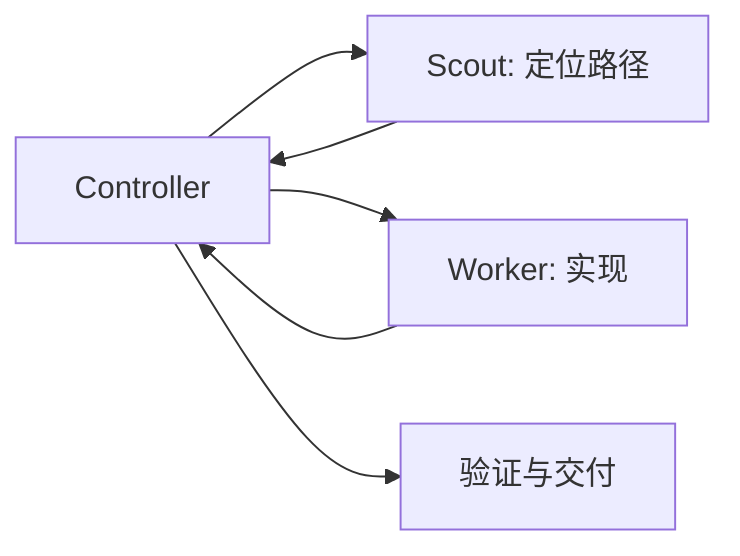
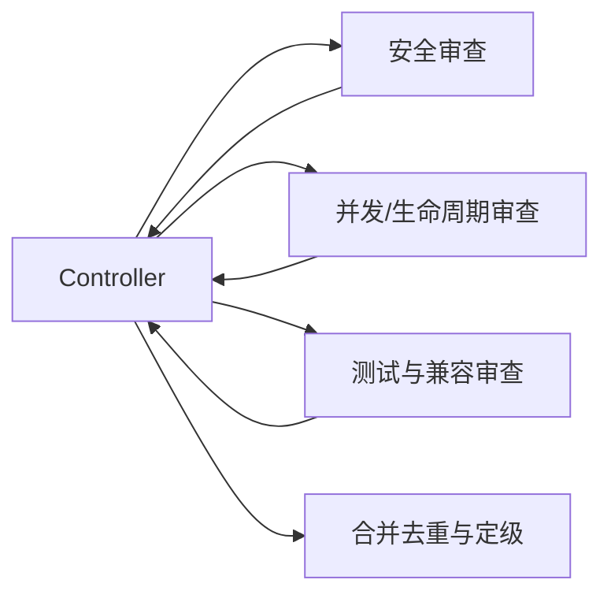
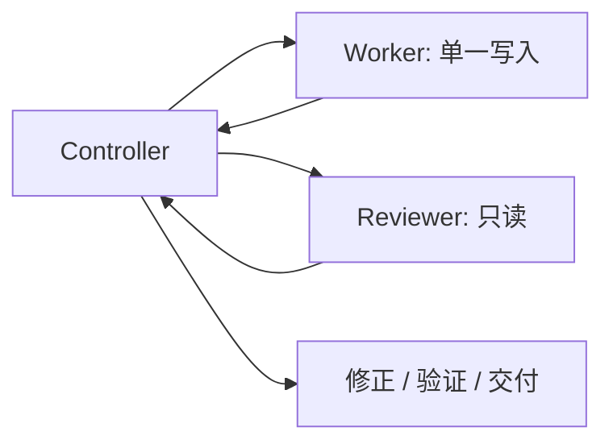
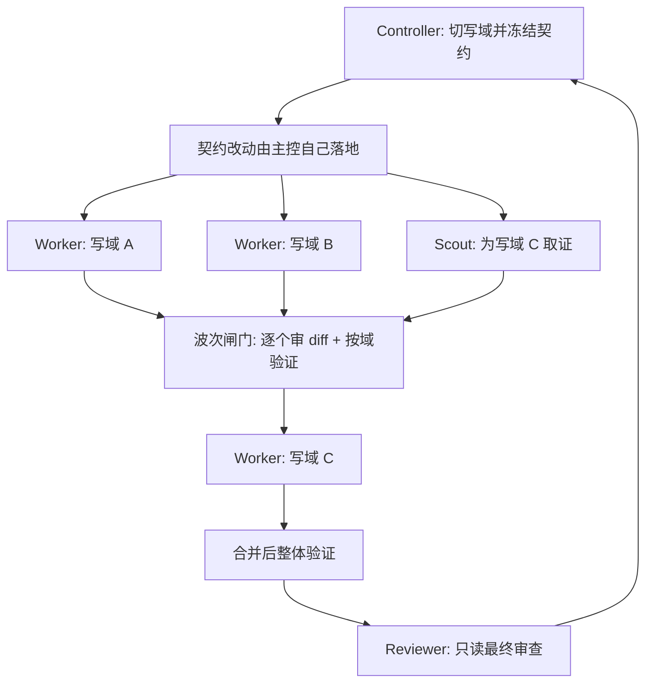

# 编排模式与示例

## 主控的职责

主会话不是“派活机器人”，而是唯一对最终结果负责的 Controller：

- 保留完整目标、用户约束、项目规则和授权边界。
- 判断哪些工作应直接做、哪些值得委派。
- 为每个子 Agent 划定目标、路径、权限、验收与停止条件。
- 避免并发写入冲突，接收并压缩子 Agent 结果。
- 检查最终 diff，运行项目允许的验证，向用户交付。

不要把整个模糊任务原样转发给子 Agent，也不要让子 Agent自行扩张范围。

## 决策流程

### 1. 先判断是否需要子 Agent

直接由主会话完成：

- 一两个文件内的小改动；
- 下一步依赖上一步结果，无法并行；
- 委派成本高于任务本身；
- 多个任务会修改同一文件或同一状态；
- 用户只要求解释、诊断或审阅，没有授权改动。

适合委派：

- 两个以上互相独立的代码/资料工作流；
- 大量搜索、日志、测试输出会污染主上下文；
- 需要独立审查安全、并发、迁移或兼容风险；
- 能用明确目录、模块或输出边界隔离；
- 长任务需要 Controller 持续保留全局状态。

### 2. 按任务形态选层级

```text
只读查找、枚举、定位              -> Luna / Haiku Scout
完全明确的机械变换或命令           -> Luna Executor（Codex）
边界清楚的普通实现与测试修复        -> Terra / Sonnet Worker，xhigh
跨模块、接口、并发、安全、生命周期   -> Sol / Opus Worker，xhigh
高风险最终审查                     -> Sol / Opus Reviewer，xhigh
多阶段、超长、代价极高的 Claude 任务 -> Fable，显式启用且 xhigh
```

关键点：**代码 Worker 不因“只是子 Agent”而降低推理强度。** 较低层级体现的是模型成本/速度，不是让代码生成使用低 effort。常规代码层仍为 `xhigh`；只有只读 Scout 与纯机械 Executor 使用较低 effort。

### 3. 并发预算、写域与波次

先把四个数字分开，否则要么不敢并行，要么并行到失控：

| 数量 | 含义 | 默认 |
|---|---|---|
| 客户端上限 | 客户端机制强制的天花板 | Codex：3 个子线程（含主线程共 4）；Claude Code：20 个并发子 Agent |
| 并发预算 | 主控自己选择同时保持活跃的数量 | 3 个活跃、1 个写入者 |
| 写域 | 校验过互不相交的可写路径集合 | 1 个 |
| Packet 总数 | 整个任务委派出去的包总数 | 不限 |

**「3」是并发默认值，不是任务配额。** 12 个 packet 是常态：跑 4 个波次，而不是开 12 条线程。提高预算是关于写入安全与主控综合带宽的决定，不是「让任务干更多活」的手段。

```text
并发预算 = min(客户端上限, 写入者 + 读取者)
写入者 = 校验过的不相交写域数量          # 默认 1
读取者 = 每个都能用一句话说清问题、
         且主控一轮能吸收的只读包数量    # 默认 2
```

一句话说不清的只读问题就还不是可拆的问题：先 Scout，再拆。两个写入者拿不到互不重叠的路径清单时，写入者只能是 1。超过客户端上限的预算不是计划，只是排队。

#### 切写域：并行写入的唯一前提

写域是「这个 Agent 可以写的路径清单」＋「其余一切对它只读」这句话。

1. 用实际证据列出每条工作流要写的路径，不要凭模块名想象。
2. 出现在两份清单里的路径全部删掉：共享路径归主控，或留给后续串行包。
3. 逐条排查共享状态陷阱：公共接口与类型声明、schema 与 migration、生成物与 vendor 目录、barrel/index 文件、lockfile 与依赖清单、格式化与 lint 配置、快照 fixture、一个断言多个域的测试文件、以及构建步骤会重写的文件。
4. 先冻结契约：接口、签名、schema、配置键的改动由主控自己先落地并验证，再告知每个写入者这些已不可变。
5. 每个域必须有独立的验证命令。必须等别的域落地才能判断对错的域不是独立域，改成串行。
6. 主控自己维护一张域表：域 ID、负责人、路径、验证命令、合并顺序。

任何一步过不去，正确答案是减少写入者，而不是提高预算。

#### 波次调度

- 一个波次 = 一组塞得进预算、且写域互不重叠的任务包。
- 波次之间是闸门：读每一份 diff、跑每个域的验证、用一手证据裁决矛盾、检查合并后的状态而不是报告的总和。
- 下一波的任务包基于「现在实际存在的状态」重写；不要把 n+1 波的包在第 n 波落地前就写好。
- 闸门发现划分错了，停的是整个计划，不只是那个包。
- 只读波次可以很宽；写入波次保持窄；混合波次里读取者不踩写入者的路径。

#### 可以提高预算的条件（必须全部满足）

1. 本波次全部只读，或每个写入者都有用显式路径清单校验过的独立写域。
2. 所有共享契约已冻结或归主控所有。
3. 每个域有自己的验证命令。
4. 每个包都在结果预算内返回，n 份结果仍能压缩成一个一致的状态。
5. 主控有余力在下一波开始前审完本波每一处写入。
6. 每多一个 Agent 都是从关键路径上挪走工作，而不是重复探索。
7. 额外 token / credits 开销已获授权，且客户端上限容得下这个数量而不排队。

提高时一次提到一个明确数字、把这个数字报告出来，宽波次结束后回到默认值。

#### 永远不要为这些情形提高预算

- 同文件或路径重叠的工作，包括两个 Agent 改同一个大模块；
- 一个 migration、一个 schema、一个状态机，不论牵涉多少调用点；
- 会移动其他包正在读取的符号的重构；
- 边界还在摸索的任务：先 Scout，再决定；
- 没有按域验证手段的工作；
- 需要写入者之间边做边商量的任务；
- 只为「审得更全」而堆 Reviewer。Reviewer 只读、扇出便宜，但数量替代不了一个负责到底的最终审查。

#### 背压与失败

- Claude Code 超上限会以 `Concurrent subagent limit reached` 拒绝并明确要求不要重试：把它当调度信息，把那个包排到下一波。
- fork 运行期间占用一个槽位；resume 一个已完成的子 Agent 会拿到新槽位且不做上限检查，所以 resume 多的计划会静默超出预期预算——自己记账。
- 处于最高 effort 的会话不受并发上限约束，那里唯一的限制就是你声明的预算：派发前先把数字说出来。
- Codex 调高上限后要验证实际并行度。新版由 multi-agent 第二代特性接管并发时，旧键可能被静默忽略（社区报告生效键为 `features.multi_agent_v2.max_concurrent_threads_per_session`），以观测值为准；不要为了让上限生效去开启无关的 feature flag。
- 出现写入冲突：停掉整个波次、检查工作树、剩余写入者串行执行；绝不用破坏性的版本控制清理来「解决」冲突。
- 收到 `partial` / `blocked`：在主控里重切边界。不要让子 Agent 自行扩张，也不要把同一个包原样升级到更高层级模型。
- 两个 Agent 自信地互相矛盾：这是划分缺陷，不是可以取平均的分歧。

## 标准任务包

每次委派至少包含：

```text
目标：完成什么可观察结果
上下文：已知事实、入口与为什么现在做
写域：允许写入的路径清单；只读包写「只读」
禁止：不能做的动作、不能碰的路径
波次与合并顺序：属于第几波、波内第几个合并
权限：只读或写入；是否可运行命令
验收：完成的证据和允许的验证
结果预算：最多几条发现 / 多少行，超出就压缩
停止条件：冲突、缺权限、假设不成立时如何处理
返回格式：状态、结论、文件/符号、验证、边界、风险、下一步
```

写域给的是路径清单，不是模块名；清单之外的一切对该 Agent 只读。两个并发包不允许包含同一个问题或同一处改动——重复探索是双倍成本换同一个不确定性。

示例：

```text
目标：修复支付回调重复处理导致的双重记账。
上下文：入口在 callbacks/payment；幂等键已由网关传入。
写域：src/payments/callbacks/** 和对应单元测试。
禁止：不改数据库 schema，不提交，不部署，不修改公共 API。
权限：单一写入者；可运行 payment package 的单元测试。
验收：重复回调只记账一次；现有正常回调测试通过。
停止条件：若需要 schema 或跨服务契约变更，停止并回报主控。
返回：状态、改动文件/符号、关键决策、测试结果、残余风险。
```

## 标准结果契约

Scout / Worker 返回：

```text
status: completed | partial | blocked
summary: 1–3 句
findings_or_changes: 最多 5 项，带文件/符号证据
validation: 执行了什么、结果如何
domain_boundary: 守住了 / 需要写域外的哪些路径
uncertainties: 尚未证实的事实
risks: 残余风险
recommended_next_step: 主控下一步
```

Reviewer 返回 findings first，按严重程度排序。每项必须包含：位置、触发条件、影响、证据和验证/缓解方式；没有实质问题时明确写明。

## 常用拓扑

### 探索后实现



适合根因未知但实现范围预计较小的任务。Scout 只返回入口、依赖和证据，主控再构造精确实现包。

### 并行只读审查



这是最安全、收益最稳定的并行形式，因为三个分支都不写代码。

### 单写入者 + 独立 Reviewer



适合跨模块或高代价变更。Reviewer 不直接修复，避免审查责任与实现责任混在一起。

### 多写入者的波次编排



只有写域确实不相交、契约已冻结、每个域都有独立验证时才用这个形态。拿不到这三件，就退回「单写入者 + 独立 Reviewer」。

#### 实例：15 处调用点、3 个模块、客户端上限 3

| 波次 | 活跃 | 任务包 | 闸门 |
|---|---|---|---|
| 0 | 1 读 | Scout 摸清调用点、归属与测试 | 主控确认 3 个候选写域和共享接口 |
| 1 | 3 读 | 每个候选域一个 Scout，各回答一个隐藏耦合问题 | 接受或重切划分；重叠路径收归主控 |
| 2 | 0 | 主控自己落地被冻结的接口改动 | 接口固定并验证，通知写入者不可变 |
| 3 | 2 写 + 1 读 | 实现写域 A、B；Scout 为写域 C 取证 | 两份 diff 都审、两个域验证都跑 |
| 4 | 1 写 | 实现写域 C | 跨域联合验证 |
| 5 | 1 审 | 只读最终审查整个改动 | 主控裁决 findings 并交付 |

9 个任务包、同时活跃从不超过 3 个、每个域一个写入者、一个负责到底的主控。

## Codex 路由

- 主会话通常为 Sol `xhigh`，保留完整任务状态。
- `luna_scout`：读代码、查配置、定位测试，不修改。
- `luna_executor`：只执行完全指定的机械步骤；遇到语义判断就停止。
- `terra_worker`：常规实现，`xhigh`；触及安全/并发/公共接口时升级。
- `sol_worker`：复杂实现，`xhigh`。
- `sol_reviewer`：复杂或高风险改动后的只读审查，`xhigh`。

Codex 当前本地客户端会在用户直接要求，或适用的 `AGENTS.md` / skill 明确要求时委派。安装本 skill 和规则片段后，用户可以正常描述任务，由主会话按规则判断。

## Claude Code 路由

- 默认主会话推荐 `opus[1m]` + `xhigh`。
- `haiku-scout`：只读探索。
- `sonnet-worker`：普通实现，`xhigh`。
- `opus-worker` / `opus-reviewer`：复杂实现与高风险审查，`xhigh`。
- `fable-controller`：通过 `claude --agent fable-controller` 显式作为主会话启动。
- `fable-worker` / `fable-reviewer`：仅在 Fable 可用且用户已明确选择或额度/credits 已确认时使用。

Fable 不可用时停止该分支并交回主控决定；不要无限重试，也不要误称 billing/rate-limit 错误会触发 fallback。

## 失败与升级

子 Agent 应停止并升级给主控，而不是自行扩大范围，典型条件包括：

- 需要修改未分配路径；
- 发现公共接口、数据库 schema 或部署流程变化；
- 需要新的外部权限、凭据或付费额度；
- 工作树已有冲突性用户改动；
- 项目规则禁止所需验证；
- 原假设不成立，任务包需重写；
- 模型或工具不可用。

主控可以缩小任务、重新分配、请求用户决策，或直接接管。失败不是授权升级的理由。

## 反模式

- 为了“看起来 Agentic”而拆分小任务。
- 把并发上限当成任务配额：要么不敢超过 3 个包，要么为了「用满」而堆 Agent。
- 三个 Worker 同时修改共享文件。
- 没有冻结共享契约就开并行写入波次。
- 调高了客户端上限却没验证实际并行度，把「配置值」当成「生效值」。
- 两个 Agent 并行探索同一个不确定性，花双倍成本拿回同一句「不确定」。
- 把完整聊天记录塞给每个子 Agent。
- 让 Scout 直接实现，或让 Reviewer 一边审一边改。
- 代码 Worker 使用低 effort，导致边界条件与回归检查不足。
- 把模型 fallback 当成额度不足时的自动切换。
- 让 Codex 和 Claude 互相启动、传递凭据或共同写同一工作树。
- 子 Agent 自行 commit、push、deploy 或扩大外部影响。
